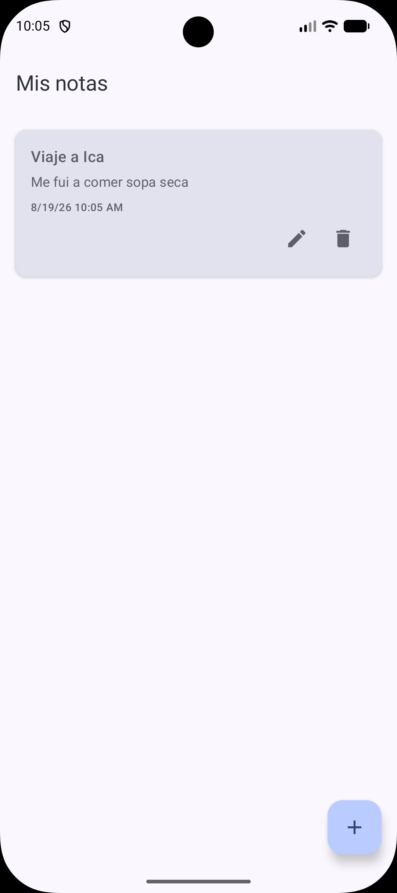
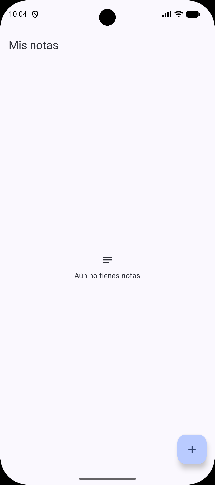
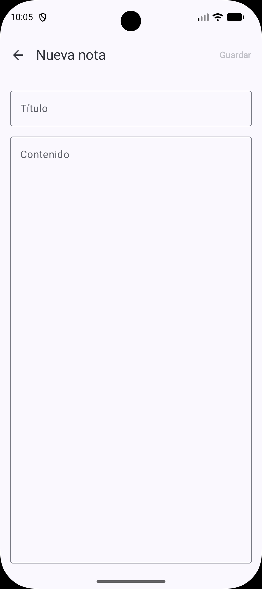

# Notas — Clean Architecture + MVI + Jetpack Compose

Bloc de notas Android local (sin backend), pensado como referencia didáctica de
Clean Architecture + MVI implementado a mano con Jetpack Compose y Material 3.

## Capturas

| Listado | Estado vacío | Crear nota |
| --- | --- | --- |
|  |  |  |

## Cómo correr el proyecto

1. Abrir la carpeta raíz en Android Studio (o ejecutar `./gradlew assembleDebug`
   / `gradlew.bat assembleDebug` desde la terminal).
2. Sincronizar Gradle — descarga Room, Hilt, Navigation Compose, KSP y
   kotlinx.serialization desde el version catalog (`gradle/libs.versions.toml`).
3. Ejecutar la configuración `app` en un emulador o dispositivo con `minSdk 24`+.

No requiere backend, claves de API ni configuración adicional: toda la
persistencia es local con Room.

## Mapa de capas

```
presentation  →  domain  ←  data
```

- **`domain`** (`domain/`): Kotlin puro. `Note`, la interfaz `NoteRepository`
  y los 5 casos de uso. Sin imports de Android, Room, Hilt ni Compose.
- **`data`** (`data/`): implementación de Room (`NoteEntity`, `NoteDao`,
  `NotesDatabase`), `NoteMapper` (funciones de extensión `toDomain()` /
  `toEntity()`) y `NoteRepositoryImpl`, que implementa `NoteRepository`
  completo (incluidos `update` y `delete`).
- **`presentation`** (`presentation/`): MVI a mano por pantalla —
  `notelist` (listado) y `noteeditor` (crear/editar) — cada una con su
  contrato (`State` / `Intent` / `Effect`), su `ViewModel` y sus composables
  stateless. `navigation/` contiene las rutas type-safe (`Routes.kt`,
  `NotesNavHost.kt`) y `theme/` el Material 3 con dynamic color.
- **`di`**: `DatabaseModule` (Room) y `RepositoryModule` (`@Binds` de
  `NoteRepositoryImpl` a `NoteRepository`).

## Estado funcional

| Funcionalidad | Estado |
| --- | --- |
| Listar notas | ✅ Funcional de punta a punta |
| Crear nota | ✅ Funcional de punta a punta |
| Editar nota | ⛔ Botón visible; muestra Snackbar "no implementado" |
| Eliminar nota | ⛔ Botón visible; muestra Snackbar "no implementado" |

## Ejercicios pendientes

### Ejercicio 1 — Eliminar

1. Implementar `DeleteNoteUseCase` (`domain/usecase/DeleteNoteUseCase.kt`):
   delegar en `NoteRepository.deleteNote(id)`, ya implementado en `data`.
2. En `NoteListViewModel`, reemplazar el manejo actual de
   `Intent.DeleteNoteClicked` (que solo emite el Snackbar de "no
   implementado") para que invoque el caso de uso dentro de
   `viewModelScope`.
3. No hace falta recargar la lista a mano: el `Flow` del DAO re-emite solo.
4. Opcional: pedir confirmación con un `AlertDialog` antes de borrar.

### Ejercicio 2 — Editar

1. Implementar `GetNoteByIdUseCase` y `UpdateNoteUseCase`
   (`domain/usecase/`): delegar en `NoteRepository.getNoteById(id)` y
   `NoteRepository.updateNote(note)`, ya implementados en `data`.
   `UpdateNoteUseCase` debe refrescar `updatedAt` antes de guardar.
2. En `NoteListViewModel`, hacer que `Intent.EditNoteClicked` navegue al
   editor con el `noteId` (hoy siempre navega con `noteId = null`).
3. En `NoteEditorViewModel`, el `noteId` ya se lee de
   `savedStateHandle.toRoute<Routes.NoteEditorRoute>()`; falta usarlo para
   invocar `GetNoteByIdUseCase` y precargar el `State` cuando no sea `null`.
4. Al guardar en modo edición, invocar `UpdateNoteUseCase` en vez de
   `CreateNoteUseCase`.

## Stack

Kotlin · Jetpack Compose · Material 3 · MVI a mano · Hilt · Room (KSP) ·
Coroutines/Flow · Navigation Compose type-safe (`kotlinx.serialization`).
